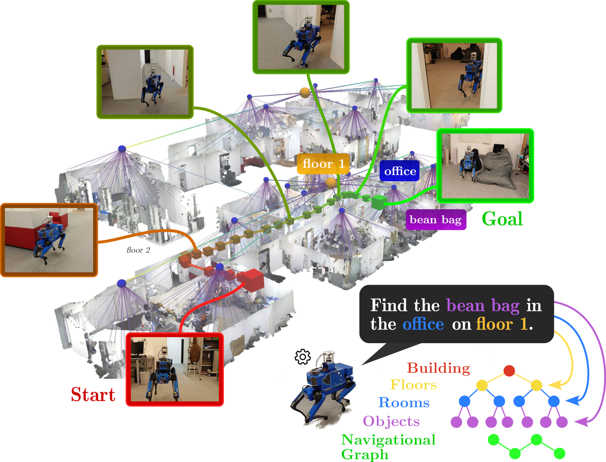
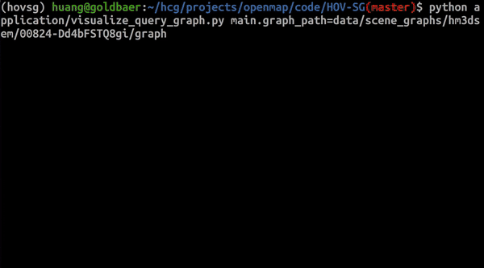

# HOV-SG
[](https://arxiv.org/abs/2403.17846)
[](https://hovsg.github.io/)
[](https://opensource.org/licenses/MIT)
[](https://hovsg.github.io/static/images/hovsg_rss_final.mp4)


This repository is the official implementation of the paper:

> **Hierarchical Open-Vocabulary 3D Scene Graphs for Language-Grounded Robot Navigation**
>
> [Abdelrhman Werby]()&ast;, [Chenguang Huang](http://www2.informatik.uni-freiburg.de/~huang/)&ast;, [Martin Büchner](https://rl.uni-freiburg.de/people/buechner)&ast;, [Abhinav Valada](https://rl.uni-freiburg.de/people/valada), and [Wolfram Burgard](https://www.utn.de/person/wolfram-burgard/). <br>
> &ast;Equal contribution. <br> 
> 
> *arXiv preprint arXiv:2403.17846*, 2024 <br>
> (Accepted for *Robotics: Science and Systems (RSS), Delft, Netherlands*, 2024.)

<p align="center">
  
</p>

## 🏗 Setup
1. Clone and set up the HOV-SG repository
```bash
git clone https://github.com/hovsg/HOV-SG.git
cd HOV-SG

# set up virtual environment and install habitat-sim afterwards separately to avoid errors.
conda env create -f environment.yaml
conda activate hovsg
conda install habitat-sim -c conda-forge -c aihabitat

# set up the HOV-SG python package
pip install -e .
```

### Open CLIP
HOV-SG uses the Open CLIP model to extract features from RGB-D frames. To download the Open CLIP model checkpoint `CLIP-ViT-H-14-laion2B-s32B-b79K` please refer to [Open CLIP](https://huggingface.co/laion/CLIP-ViT-H-14-laion2B-s32B-b79K).
```bash
mkdir checkpoints
wget https://huggingface.co/laion/CLIP-ViT-H-14-laion2B-s32B-b79K/resolve/main/open_clip_pytorch_model.bin?download=true -O checkpoints/temp_open_clip_pytorch_model.bin && mv checkpoints/temp_open_clip_pytorch_model.bin checkpoints/laion2b_s32b_b79k.bin
```
Another option is to use the OVSeg fine-tuned Open CLIP model, which is available under [here](https://github.com/facebookresearch/ov-seg):
```bash
pip install gdown
gdown --fuzzy https://drive.google.com/file/d/17C9ACGcN7Rk4UT4pYD_7hn3ytTa3pFb5/view -O checkpoints/ovseg_clip.pth
```

### SAM
HOV-SG uses [SAM](https://github.com/facebookresearch/segment-anything) to generate class-agnostic masks for the RGB-D frames. To download the SAM model checkpoint `sam_v2` execute the following:
```bash
wget https://dl.fbaipublicfiles.com/segment_anything/sam_vit_h_4b8939.pth -O checkpoints/sam_vit_h_4b8939.pth
```

## 🖼️ Prepare dataset

### Habitat Matterport 3D Semantics
HOV-SG takes posed RGB-D sequences as input. In order to represent hierarchical multi-story scenes we make use of the Habitat 3D Semantics dataset ([HM3DSem](https://aihabitat.org/datasets/hm3d-semantics/)). We provide a script and pose files (`data/hm3dsem_poses/`) to generate RGB-D sequences using the [habitat-sim](https://github.com/facebookresearch/habitat-sim) simulator. The script can be found under `hovsg/data`.
- Download the [Habitat Matterport 3D Semantics](https://github.com/matterport/habitat-matterport-3dresearch) dataset.
- To generate RGBD sequences, run the following command:
    ```bash
    python data/habitat/gen_hm3dsem_from_poses.py --dataset_dir <hm3dsem_dir> --save_dir data/hm3dsem_walks/
    ```

    <details>
    <summary>Make sure that the <code>hm3dsem_dir</code> has the following structure</summary>
    
    ```
    ├── hm3dsem_dir
    │   ├── hm3d_annotated_basis.scene_dataset_config.json # this file is necessary
    │   ├── val
    │   │   └── 00824-Dd4bFSTQ8gi
    │   │         ├── Dd4bFSTQ8gi.basis.glb
    │   │         ├── Dd4bFSTQ8gi.basis.navmesh
    │   │         ├── Dd4bFSTQ8gi.glb
    │   │         ├── Dd4bFSTQ8gi.semantic.glb
    │   │         └── Dd4bFSTQ8gi.semantic.txt
    ...
    ```

    </details>
We only used the following scenes from the Habitat Matterport 3D Semantics dataset:
<details>
  <summary>Show Scenes ID</summary>
  
  1. `00824-Dd4bFSTQ8gi`
  2. `00829-QaLdnwvtxbs`
  3. `00843-DYehNKdT76V`
  4. `00847-bCPU9suPUw9`
  5. `00849-a8BtkwhxdRV`
  6. `00861-GLAQ4DNUx5U`
  7. `00862-LT9Jq6dN3Ea`
  8. `00873-bxsVRursffK`
  9. `00877-4ok3usBNeis`
  10. `00890-6s7QHgap2fW`

</details>

To evaluate semantic segmentation cababilities, we used [ScanNet](http://www.scan-net.org/) and [Replica](https://github.com/facebookresearch/Replica-Dataset).
### ScanNet
To get an RGBD sequence for ScanNet, download the ScanNet dataset from the [official website](http://www.scan-net.org/). The dataset contains RGB-D frames compressed as .sens files. To extract the frames, use the [SensReader/python](https://github.com/ScanNet/ScanNet/blob/master/SensReader/python).
We used the following scenes from the ScanNet dataset:

<details>
  <summary>Show Scenes ID</summary>

  1. `scene0011_00`
  2. `scene0050_00`
  2. `scene0231_00`
  3. `scene0378_00`
  4. `scene0518_00`
</details>

### Replica
To get an RGBD sequence for Replica, Instead of the original Replica dataset, download the scanned RGB-D trajectories of the Replica dataset provided by [Nice-SLAM](https://github.com/cvg/nice-slam). It contains rendered trajectories using the mesh models provided by the original Replica datasets. 
Download the Replica RGB-D scan dataset using the downloading [script](https://github.com/cvg/nice-slam/blob/master/scripts/download_replica.sh) in [Nice-SLAM](https://github.com/cvg/nice-slam#replica-1).

```bash
wget https://cvg-data.inf.ethz.ch/nice-slam/data/Replica.zip -O data/Replica.zip && unzip data/Replica.zip -d data/Replica_RGBD && rm data/Replica.zip 
```

To evaluate against the ground truth semantics labels, you also need also to download the original Replica dataset from the [Replica](https://github.com/facebookresearch/Replica-Dataset) as it contains the ground truth semantics labels as .ply files.
```bash
git clone https://github.com/facebookresearch/Replica-Dataset.git data/Replica-Dataset
chmod +x data/Replica-Dataset/download.sh && data/Replica-Dataset/download.sh data/Replica_original
```
We only used the following scenes from the Replica dataset:
<details>
  <summary>Show Scenes ID</summary>
  
  1. `office0`
  2. `office1`
  3. `office2`
  4. `office3`
  5. `office4`
  6. `room0`
  7. `room1`
  8. `room2`

</details>

## 📂 Datasets file strutcre
The Data folder should have the following structure:

<details>
  <summary>Show data folder structure</summary>
  
```
├── hm3dsem_walks
│   ├── val
│   │   ├── 00824-Dd4bFSTQ8gi
│   │   │   ├── depth
│   │   │   │   ├── Dd4bFSTQ8gi-000000.png
│   │   │   │   ├── ...
│   │   │   ├── rgb
│   │   │   │   ├── Dd4bFSTQ8gi-000000.png
│   │   │   │   ├── ...
│   │   │   ├── semantic
│   │   │   │   ├── Dd4bFSTQ8gi-000000.png
│   │   │   │   ├── ...
│   │   │   ├── pose
│   │   │   │   ├── Dd4bFSTQ8gi-000000.png
│   │   │   │   ├── ...
|   |   ├── 00829-QaLdnwvtxbs
|   |   ├── ..
├── Replica
│   ├── office0
│   │   ├── results
│   │   │   ├── depth0000.png
│   │   │   ├── ...
│   │   |   ├── rgb0000.png
│   │   |   ├── ...
│   │   ├── traj.txt
│   ├── office1
│   ├── ...
├── ScanNet
│   ├── scans
│   │   ├── scene0011_00
│   │   │   ├── color
│   │   │   │   ├── 0.jpg
│   │   │   │   ├── ...
│   │   │   ├── depth
│   │   │   │   ├── 0.png
│   │   │   │   ├── ...
│   │   │   ├── poses
│   │   │   │   ├── 0.txt
│   │   │   │   ├── ...
│   │   │   ├── internsics
│   │   │   │   ├── intrinsics_color.txt
│   │   │   │   ├── intrinsics_depth.txt
│   │   ├── ..
```

</details>


## :rocket: Run 

### Create Scene Graphs (only for Habitat Matterport 3D Semantics):
```bash
python application/create_graph.py main.dataset=hm3dsem main.dataset_path=data/hm3dsem_walks/val/00824-Dd4bFSTQ8gi/ main.save_path=data/scene_graphs/00824-Dd4bFSTQ8gi
```
<details>
  <summary>This will generate a scene graph for the specified RGB-D sequence and save it. The following files are generated:</summary>

```
├── graph
│   ├── floors
│   │   ├── 0.json
│   │   ├── 0.ply
│   │   ├── 1.json
│   │   ├── ...
│   ├── rooms
│   │   ├── 0_0.json
│   │   ├── 0_0.ply
│   │   ├── 0_1.json
│   │   ├── ...
│   ├── objects
│   │   ├── 0_0_0.json
│   │   ├── 0_0_0.ply
│   │   ├── 0_0_1.json
│   │   ├── ...
│   ├── nav_graph
├── tmp
├── full_feats.pt
├── mask_feats.pt
├── full_pcd.ply
├── masked_pcd.ply
```
The `graph` folder contains the generated scene graph hierarchy, the first number in the file name represents the floor number, the second number represents the room number, and the third number represents the object number. The `tmp` folder holds intermediate results obtained throughout graph construction. The `full_feats.pt` and `mask_feats.pt` contain the features extracted from the RGBD frames using the Open CLIP and SAM models. the former contains per point features and the latter contains the features for the object masks. The `full_pcd.ply` and `masked_pcd.ply` contain the point cloud representation of the RGB-D frames and the instance masks of all objects, respectively.

</details>

### Visualize Scene Graphs
```bash
python application/visualize_graph.py graph_path=data/scene_graphs/hm3dsem/00824-Dd4bFSTQ8gi/graph
```


### Interactive visualization of Scene Graphs with Queries

#### Setup OpenAI
In order to test graph queries with HOV-SG, you need to setup an OpenAI API account with the following steps:
1. [Sign up an OpenAI account](https://openai.com/blog/openai-api), login your account, and bind your account with at least one payment method.
2. [Get you OpenAI API keys](https://platform.openai.com/account/api-keys), copy it.
3. Open your `~/.bashrc` file, paste a new line `export OPENAI_KEY=<your copied key>`, save the file, and source it with command `source ~/.bashrc`. Another way would be to run `export OPENAI_KEY=<your copied key>` in the teminal where you want to run the query code.

#### Evaluate query against pre-built hierarchical scene graph 
```bash
python application/visualize_query_graph.py main.graph_path=data/scene_graphs/hm3dsem/00824-Dd4bFSTQ8gi/graph
```
After launching the code, you will be asked to input the hierarchical query. An example is `chair in the living room on floor 0`. You can see the visualization of the top 5 target objects and the room it lies in.


### Extract feature map for Semantic Segmentation (only for ScanNet and Replica)
```bash
python application/semantic_segmentation.py main.dataset=replica main.dataset_path=Replica/office0 main.save_path=data/sem_seg/office0
```

### Evaluate Semantic Segmentation (only for ScanNet and Replica)
```bash
python application/eval/evaluate_sem_seg.py dataset=replica scene_name=office0 feature_map_path=data/sem_seg/office0
```

### Evaluate Scene Graphs (WIP)
```bash
python application/eval/evaluate_graph.py main.graph_path=data/scene_graphs/00824-Dd4bFSTQ8gi
```

## 📔 Abstract

Recent open-vocabulary robot mapping methods enrich dense geometric maps with pre-trained visual-language features. While these maps allow for the prediction of point-wise saliency maps when queried for a certain language concept, largescale environments and abstract queries beyond the object level still pose a considerable hurdle, ultimately limiting languagegrounded robotic navigation. In this work, we present HOVSG, a hierarchical open-vocabulary 3D scene graph mapping approach for language-grounded indoor robot navigation. Leveraging open-vocabulary vision foundation models, we first obtain state-of-the-art open-vocabulary segment-level maps in 3D and subsequently construct a 3D scene graph hierarchy consisting of floor, room, and object concepts, each enriched with openvocabulary features. Our approach is able to represent multistory buildings and allows robotic traversal of those using a cross-floor Voronoi graph. HOV-SG is evaluated on three distinct datasets and surpasses previous baselines in open-vocabulary semantic accuracy on the object, room, and floor level while producing a 75% reduction in representation size compared to dense open-vocabulary maps. In order to prove the efficacy and generalization capabilities of HOV-SG, we showcase successful long-horizon language-conditioned robot navigation within realworld multi-story environments. 

If you find our work useful, please consider citing our paper:
```
@article{werby23hovsg,
Author = {Abdelrhman Werby and Chenguang Huang and Martin Büchner and Abhinav Valada and Wolfram Burgard},
Title = {Hierarchical Open-Vocabulary 3D Scene Graphs for Language-Grounded Robot Navigation},
Year = {2024},
journal = {Robotics: Science and Systems},
} 
```

## 👩‍⚖️  License

For academic usage, the code is released under the [MIT](https://opensource.org/licenses/MIT) license.
For any commercial purpose, please contact the authors.


## 🙏 Acknowledgment

This work was funded by the German Research Foundation
(DFG) Emmy Noether Program grant number 468878300, the
BrainLinks-BrainTools Center of the University of Freiburg,
and an academic grant from NVIDIA.
